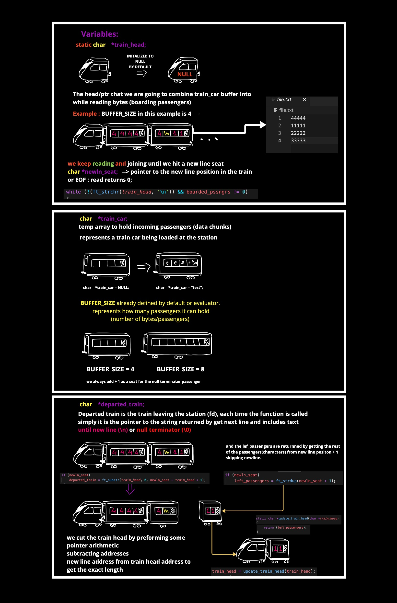

# WHAT IS THE GET_NEXT_LINE FUNCTION ?

In this project, we were tasked with implementing the **get_next_line** function, which reads and returns a single line from a file referenced by a file descriptor `(fd)`, each time it is called thanks to the brilliant utilization of `static variables`, it is also an interesting concept we'll learn about during this task.

##### How it is prototyped:

```c
char  *get_next_line(int fd);
```


- Return value : the function returns a string `char *` , which is the line read from the file referenced by `(int fd)`

- Parameter : the get_next_line function takes a small positive integer as an argument when it is called, this [file descriptor](https://en.wikipedia.org/wiki/File_descriptor) is a reference point or a [handle](https://en.wikipedia.org/wiki/Handle_(computing)) to an open file within the system, it is passed as a signed integer to handle and manage errors in cases such as invalid or closed file descriptors, we'll dive more into this world of FDs in a bit.

**--> Now let's dive into the inner workings of our get_next_line function.**

**or as I would like to call it Get Next Train.**

# GET_NEXT_TRAIN.

I built my logic around the idea of fetching departed trains, in this case our lines, from a station referenced by an address, where basically the station is the file we're reading from
and the address number is the file descriptor, which has the information needed for us to access the station (file).

What to keep in mind :\
Train : The line we read from the file.\
Address : The file descriptor number referencing the file.\
Station : The file we are reading from.


### IMPORTANT VARIABLES VISUALIZED : 


